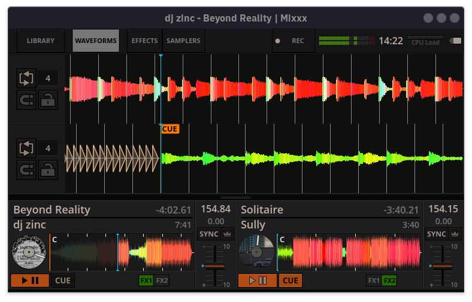
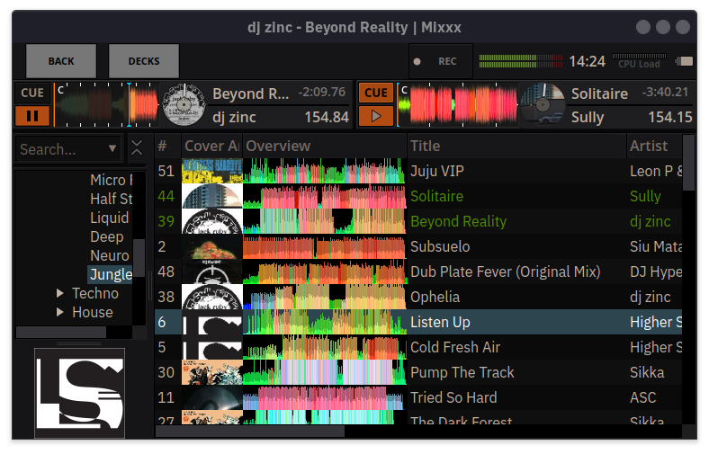
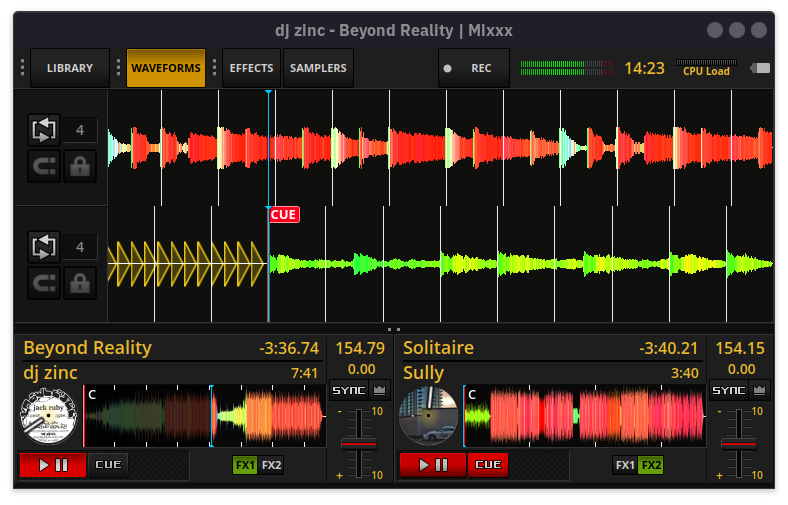

# LateNightMini

LateNightMini is a (work in progress) Mixxx skin with a compact workflow for smaller touch displays.
It is based on the default LateNight skin.

Its intended to be used with a MIDI controller like the DDJ-FLX4 and a [Raspberry Pi in stand alone mode](https://github.com/ghztomash/StandaloneMixxx).

## Screenshots

### PaleMoon





### Classic



## Features

- Two-deck layout with size modes: full, compact, and mini
- Optimized for small touch displays 760x440 
- Waveform overviews
- Keylock and Quantize buttons
- Built-in themes: `PaleMoon` and `Classic`

## Installation

Clone this project into your Mixxx skins directory:

```sh
git clone https://github.com/ghztomash/LateNightMini.git ~/.mixxx/skins/LateNightMini
```

Common locations:

- Linux: `~/.mixxx/skins/`
- Windows: `%LOCALAPPDATA%\\Mixxx\\skins\\`
- macOS: `~/Library/Containers/org.mixxx.mixxx/Data/Library/Application Support/Mixxx/skins/`

Then open Mixxx and select `LateNightMini` in `Preferences > Interface`.

## Contributors

- [Tomash GHz](https://github.com/ghztomash)

Based on the work of:

- [jus](s.brandt@mixxx.org)
- [Owen Williams](owilliams@mixxx.org)
- [ronso0](ronso0@mixxx.org)

## References

For more inspiration, check out the amazing work of:

- [Pioneered](https://github.com/timewasternl/Pioneered)
- (XDJ100SX)[https://github.com/marcmonka/XDJ100SX]
- [Compact Skin for Raspberry Pi 10.1 touch display](https://mixxx.discourse.group/t/compact-skin-for-raspberry-pi-10-1-touch-display/28955)
- [Mobile Deere Skin for 8” touch screen](https://mixxx.discourse.group/t/mobile-deere-skin-for-8-touch-screen/27917)
